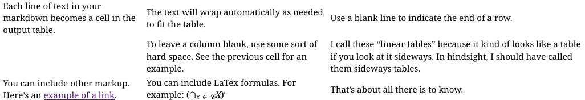

# pandoc-linear-table

A pandoc filter that provides a Markdown extension that supports text wrapping in table cells.
Here's an example of the syntax:

    ```{.linear-table}
    Each line of text in your markdown becomes a cell in the output table.
    The text will wrap automatically as needed to fit the table.
    Use a blank line to indicate the end of a row.

    ` `
    To leave a column blank, use some sort of hard space. See the previous cell for an example.
    I call these "linear tables" because it kind of looks like a table if you look at it sideways. In hindsight, I should have called them sideways tables.

    You can include other markup. Here's an [example of a link](https://github.com/mhwombat/pandoc-linear-table).
    You can include LaTex formulas. For example: $(\bigcap_{x \in \mathscr{C}} X)'$
    That's about all there is to know.
    ```

Depending on your output format, the result of the above will look
like this:



As implemented, you don't have control over the vertical alignment
of cells.
This approach is sufficient for my use case, but it may not meet your
needs!

## Installation

This package is available from Hackage, or as a Nix flake.

### From Hackage

To install from Hackage, use [cabal install](https://cabal.readthedocs.io/en/stable/cabal-commands.html#cabal-install).
The package name is `pandoc-logic-proof`.

### In a Nix shell

Note: Flakes must be [enabled](https://nixos.wiki/wiki/Flakes) in your Nix or NixOS installation.

One way to use the Nix flake is to create a `shell.nix` with pandoc and this package, like so:

~~~
with (import <nixpkgs> {});
let
  pandoc-include-plus = (builtins.getFlake git+https://codeberg.org/mhwombat/pandoc-include-plus).packages.${builtins.currentSystem}.default;
in
mkShell {
  buildInputs = [
    pandoc
    pandoc-linear-table
    # add any other software you want to use in the shell.
  ];
}
~~~

Enter the shell using `nix-shell`, and this package will be available for use.

### In a Nix flake

Add pandoc-linear-table to your `flake.nix`:

```nix
{
  inputs.pandoc-linear-table.url = "github:mhwombat/pandoc-linear-table";

  outputs = { self, pandoc-linear-table }: {
    # Use in your outputs
  };
}

```

## Transforming your document

Then, you can process your document either using pandoc directly,
or through Hakyll.

### With Pandoc

Use this filter by adding `--filter=pandoc-linear-table` to your pandoc command.
For example:

    pandoc --filter=pandoc-linear-table myfile.md --output=myfile.pdf

### With Hakyll

Use this filter as a transform in Hakyll.
For example, you could modify `site.hs`, adding

```
import Text.Pandoc.Filters.LinearTable (transform)
```

and changing

```
pandocCompiler
```

to

```
pandocCompilerWithTransform defaultHakyllReaderOptions defaultHakyllWriterOptions transform
```
